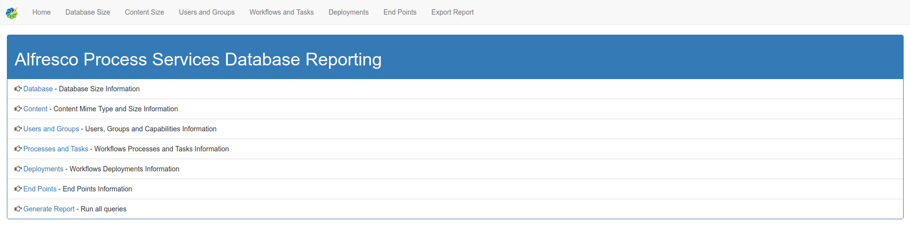
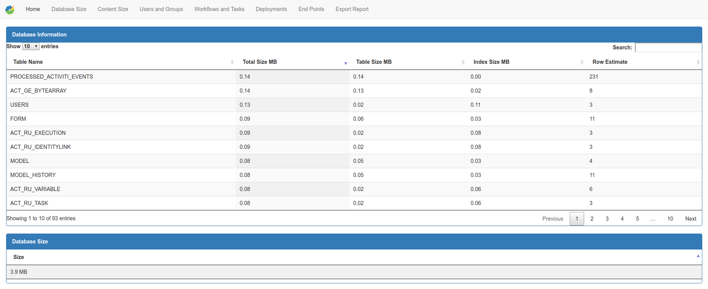

# Alfresco Process Services - Database Queries Report

Alfresco Process Services Database Queries Report is a Spring-Boot application developed to run a set of pre-defined database queries against Alfresco Process Services application. The following reports can be generated:
  - Identify Database Size
  - List Content Size
  - List Groups and Capabilities
  - List Workflows and Tasks
  - List Process Definitions Deployments
  - List End Point Connections
  - Export Report

  Works with Postgres, MySQL, Oracle and MS-SQL databases.

### Technologies

This project has been developed with a number of open source projects such as:
  - Built using Maven
  - Developed using Spring-Boot (https://projects.spring.io/spring-boot/)
  - Using mybatis for SQL mapping
  - Using Thymeleaf server-side Java template engine for manipulating object on HTML pages (http://www.thymeleaf.org/)
  - Using Bootstrap for Front-End Web development (http://getbootstrap.com/)
  - Datatables for table formatting (https://datatables.net/)


### Installation

Alresco Process Services DB Queries project requires Maven and java JDK to build. The build process generates a jar file that can be executed as a stand-alone application.

The steps to build the application are:
 - Download the application - https://git.alfresco.com/premier/aps-db-queries/repository/archive.zip?ref=master
 - Unzip it
 - Rename folder to "alfresco-db-queries"
 - Adjust aps-db-queries/src/main/resources/application.properties file
    - Set database details
    - Set port for web server
 - Compile and build application

### Compiling and building the executable jar file

**Note** : There is a compiled executable jar available in the target folder in case you just want to use that one.

Compile and build the application using Maven
```sh
$ cd aps-db-queries
$ mvn install:install-file -Dfile=./lib/ojdbc6.jar -DgroupId=com.oracle -DartifactId=ojdbc6 -Dversion=11.2.0.3 -Dpackaging=jar
$ mvn compile install
```

The generated jar file should be located in the target folder i.e. target/alfresco-db-0.0.1-SNAPSHOT.jar.

### Running the application

Copy the application.properties file to the same folder as the jar file and execute the jar file:

```sh
$ cd target
$ java -jar aps-db-0.0.1-SNAPSHOT.jar
```
Finally connect to the running application on [http://localhost:8888](http://localhost:8888) or the port specified by "server.port" parameter in application.properties. 

**Note** : When providing the application to other parties make sure you provide both the jar file and the application.properties file.

### Screenshots

- Home Page



- Database Size Report




### Todos

 - Write additional queries
 - Testing, testing and more testing

